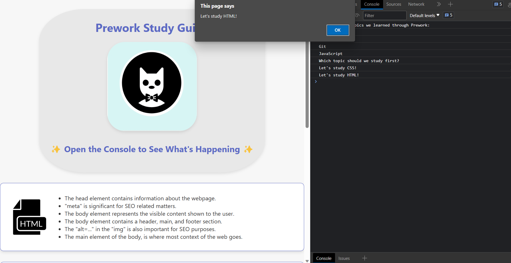

# Prework Study Guide Webpage

Simple and basic project that previews a sample of a study guide.

## Table of Contents

- [About](#about)
- [Getting Started](#getting-started)
- [Usage](#usage)
- [Development](#development)
- [License](#license)

## About

This Prework Study Guide was created for boot camp students who were going through the Prework. It contains notes on HTML, CSS, Git, and JavaScript.

## Getting Started

### Installation

N/A

## Usage

To use this Prework Study Guide, you can review the notes in each section. For suggestions on what to study first, open the Chrome DevTools by pressing Command+Option+I (macOS) or Control+Shift+I (Windows) or simple right click on the web page and click on the inspect option. A console panel should open either below or to the side of the webpage in the browser. There you will see a list of topics we learned from the prework along with a suggestion on which topic to study first.

## Development

### Folder Structure

three major files of this project are the [Index.html](https://github.com/arsalanbardsiri/prework-study-guide/blob/main/index.html) which contains the structure,[style.css](https://github.com/arsalanbardsiri/prework-study-guide/blob/main/assets/style.css) for styling purposes, and [script.js](https://github.com/arsalanbardsiri/prework-study-guide/blob/main/assets/script.js) to add some logic and make it interactive.

### Built With

[HTML](https://developer.mozilla.org/en-US/docs/Web/HTML), [CSS](https://developer.mozilla.org/en-US/docs/Web/CSS), [JavaScript](https://developer.mozilla.org/en-US/docs/Web/JavaScript).

### Credit

N/A

## License

Please refer to the LICENSE in the repo.

